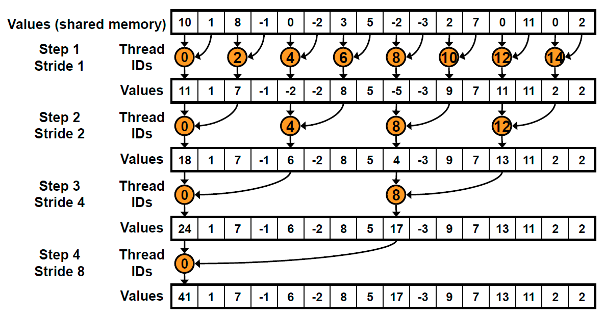
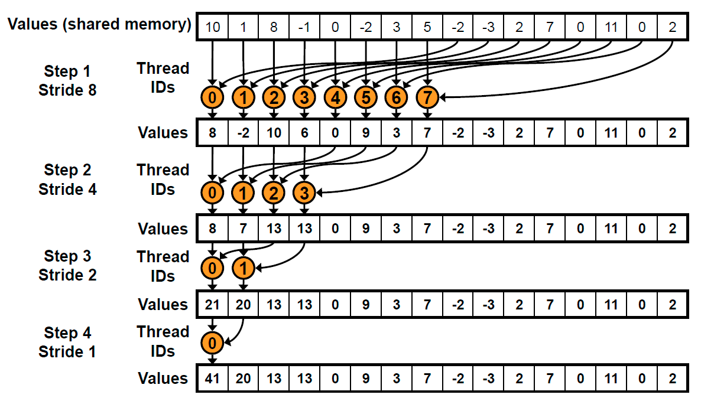

# HPC_суммирование_элементов_вектора

В данном репозитории расположено решение лабораторной работы №1 Суммирование элементов вектора.  
Задача: реализовать алгоритм сложения элементов вектора. 
Входные данные: 1 вектор размером от 1_000 до 1_000_000. 
Выходные данные: сумма элементов вектора + время вычисления 
Реализация должна содержать 2 функции сложения элементов вектора: на CPU и на GPU с применением CUDA.  
Для реализации данной задачи использовалась следующая аппаратная база: 
Центральный процессор: _Intel Xeon E5-2620 v3 @ 2,4 GHz._ 
Оперативная память: _Kllisre DDR4, 2 × 8 GB, 1600 MHz, DualChannel._ 
Графический процессор: _PALIT GTX 1650 SUPER, 4GB VRAM GDDR6._  
Рассмотрим более подробно реализацию данного алгоритма. 
Функция _sum_reduction_ является основной для работы на GPU. Стоит сказать, что для реализации данного алгоритма было принято решение использовать разделяемую память, поскольку она имеет компромисные показатели скорости и памяти относительно локально и глобальной памяти.
В основе работы функции _sum_reduction_ лежит принцип редукции. 
Применяя данный принцип к нашей задаче мы получаем, разбиение задачи вычисления всей суммы элементов массива, 
на более мелкие мелкие задачи нахождения отдельных сумм, которые в итоге и будут суммироваться, как на рисунке 1.  
  
Однако в ходе выполнения лабораторной работы было выявлено что, иная организация вычислений позволяет достичь лучших результатов. 
Ее суть заключена в делении блока на пополам и сложение соответственных элементов из половин блока как на рисунке 2.  
  
Именно данный процес и подлежал распараллеливанию, дабы ускорить процесс вычислений относитльно вычислений на центральном процессоре. Причем основному распараллеливанию подлежат целые warp-ы, если же остается меньше 32 потоков, то мы отдаем работу подсчета функции устройства. Это связано с оптимизацией, поскольку в данном случае нет необходимости вызывать функцию синхронизации syncthreads()
Теперь рассмотрим результаты работы программы.
 Размерность блока TB_SIZE   размерность вектора N_SIZE | TB_SIZE = 16 | TB_SIZE = 32 | TB_SIZE = 64 | TB_SIZE = 128 | TB_SIZE = 256| TB_SIZE = 512 | TB_SIZE = 1024 |
:----:|:----:|:----:|:----:|:----:|:----:|:----:|:----:
N_SIZE = 2^10 |0,503 | 0,508 | 0,293 | 0,451 | 0,777 | 0,234 | -- |
N_SIZE = 2^11 | -- |1,081 | 1,006 | 0,494 | 0,906 | 0,485 | 0,728
N_SIZE = 2^12 | -- | 0,971 | 1,919 | 1,303 | 1,762 | 1,029 | 2,993
N_SIZE = 2^13 | -- | -- | 2,112 | 3,556 | 1,918 | 1,791 | 1,858
N_SIZE = 2^14 | -- | -- | 7,147 | 5,562 | 4,409 | 4,432 | 3,528
N_SIZE = 2^15 | -- | -- | -- | 9,704 |10,605 |8,825 |11,028
N_SIZE = 2^16 | -- | -- | -- | 9,387 |10,712 |19,059 |13,561
N_SIZE = 2^17 | -- | -- | -- | -- | 12,056 | 12,852 | 12,43
N_SIZE = 2^18 | -- | -- | -- | -- | 18,641 | 13,095 | 13,185
N_SIZE = 2^19 | --| --| --| --| -- | 14,209 | 16,708
N_SIZE = 2^20 | --| --| --| --| -- | 16,851 | 15,789
 
